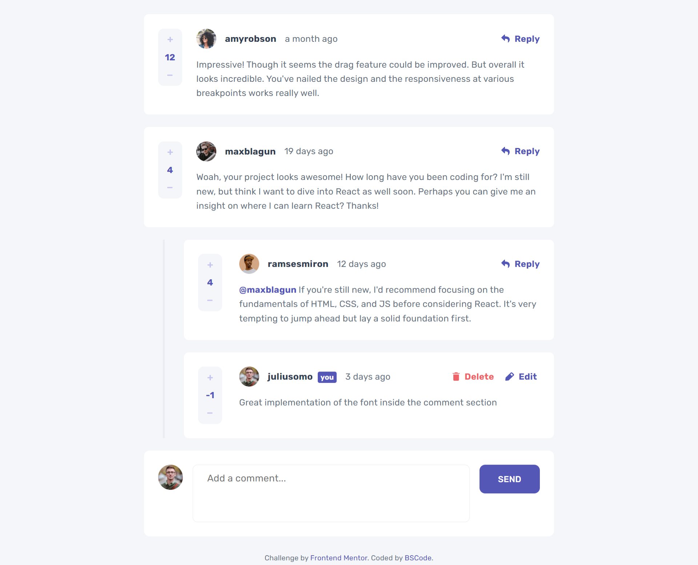

# Frontend Mentor - Interactive comments section solution

This is a solution to the [Interactive comments section challenge on Frontend Mentor](https://www.frontendmentor.io/challenges/interactive-comments-section-iG1RugEG9). Frontend Mentor challenges help you improve your coding skills by building realistic projects. 

## Table of contents

- [Frontend Mentor - Interactive comments section solution](#frontend-mentor---interactive-comments-section-solution)
  - [Table of contents](#table-of-contents)
  - [Overview](#overview)
    - [The challenge](#the-challenge)
    - [Screenshot](#screenshot)
    - [Links](#links)
  - [My process](#my-process)
    - [Built with](#built-with)
    - [What I learned](#what-i-learned)
    - [Continued development](#continued-development)
  - [Author](#author)

## Overview

### The challenge

Users should be able to:

- View the optimal layout for the app depending on their device's screen size
- See hover states for all interactive elements on the page
- Create, Read, Update, and Delete comments and replies
- Upvote and downvote comments
- **Bonus**: If you're building a purely front-end project, use `localStorage` to save the current state in the browser that persists when the browser is refreshed.
- **Bonus**: Instead of using the `createdAt` strings from the `data.json` file, try using timestamps and dynamically track the time since the comment or reply was posted.

### Screenshot

### Links

- Solution URL: [GitHub Repository](https://github.com/0-BSCode/interactive-comments-section)
- Live Site URL: [Vercel](https://interactive-comments-section-seven.vercel.app/)

## My process

### Built with

- Semantic HTML5 markup
- CSS custom properties
- Flexbox
- Mobile-first workflow
- [React](https://reactjs.org/) - JS library
- [Node](https://nodejs.org/en/) - Backend runtime environment
- [Mongo](https://www.mongodb.com/) - For database on the backend
- [Express](https://expressjs.com/) - Web application framework

### What I learned

1. Dynamic image imports (place them in public folder)
2. Dialog tag in HTML for modals
3. Managing complicated data in redux (updating object = overriding old object instead of changing specific properties)
4. Complex conditional rendering
  - Elements can be stored in a variable and that's what's passed in render
  - See Footer component
5. How to use textarea
6. Access global redux states from non-component functions
7. Pass states to utility functions for clean code
8. Render components based on screen size
9. Stylesheets overriding each other despite not being used as an import
10. Sending objects via express patch

### Continued development

1. Try using NextJS framework
2. Create cleaner code since I'm trying to organize my file structures better
3. Work on my backend development so that I can create better MERN stack applications

## Author

- GitHub - [0-BSCode](https://github.com/0-BSCode)
- Frontend Mentor - [@0-BSCode](https://www.frontendmentor.io/profile/0-BSCode)
- LinkedIn - [Bryan Sanchez](https://www.linkedin.com/in/bryan-sanchez-b316b7203/)